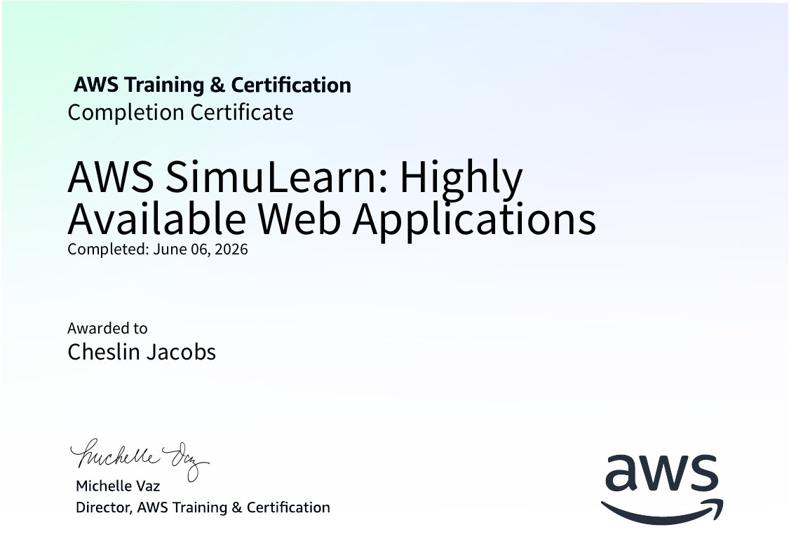
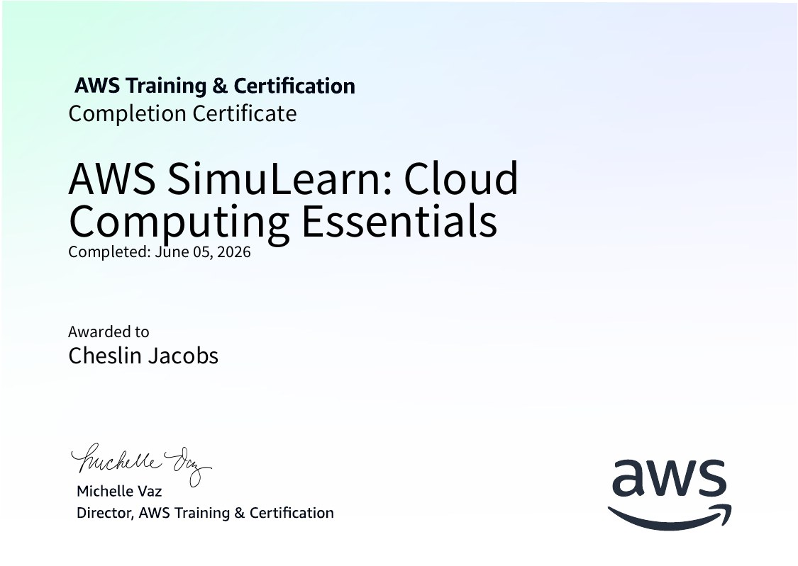
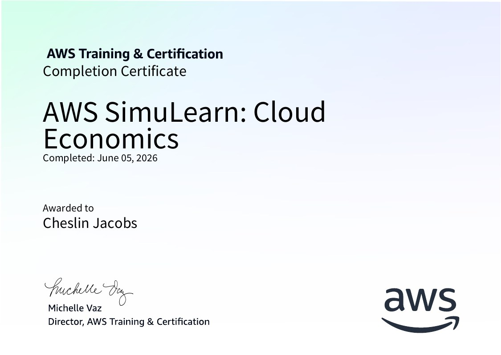
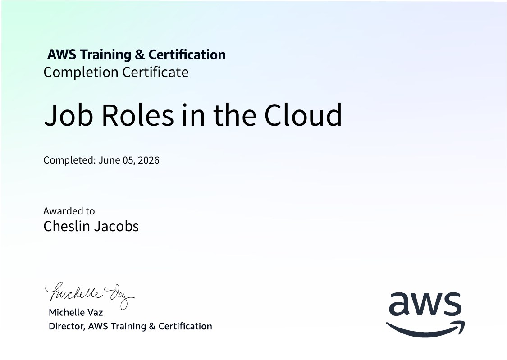
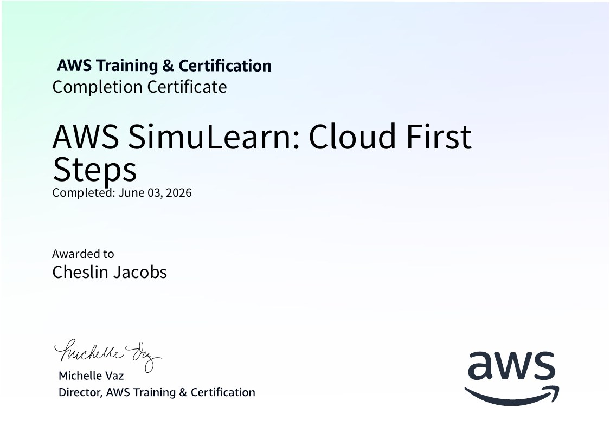

# Certification and Badges

Progress toward AWS certification and the badges earned during **AWS re/Start**. Completed courses link to their official AWS Training & Certification certificates. Everything else is marked **In progress** until it's issued.

---

## Certifications

| Certification | Status | Notes |
|---|---|---|
| AWS Certified Cloud Practitioner (CLF-C02) | **In preparation** | AWS re/Start prepares students for this exam; studying alongside the labs in this repo |

## Completed AWS Training (5 certificates)

| Course | Issued by | Completed | Certificate |
|---|---|---|---|
| AWS SimuLearn: Highly Available Web Applications | AWS Training & Certification | June 6, 2026 | [PDF](certificates/SimuLearn-Highly-Available-Web-Applications.pdf) |
| AWS SimuLearn: Cloud Computing Essentials | AWS Training & Certification | June 5, 2026 | [PDF](certificates/SimuLearn-Cloud-Computing-Essentials.pdf) |
| AWS SimuLearn: Cloud Economics | AWS Training & Certification | June 5, 2026 | [PDF](certificates/SimuLearn-Cloud-Economics.pdf) |
| Job Roles in the Cloud | AWS Training & Certification | June 5, 2026 | [PDF](certificates/Job-Roles-in-the-Cloud.pdf) |
| AWS SimuLearn: Cloud First Steps | AWS Training & Certification | June 3, 2026 | [PDF](certificates/SimuLearn-Cloud-First-Steps.pdf) |

AWS SimuLearn courses are hands-on simulations: a customer describes a business problem, and you build the solution in a live AWS console until it passes automated checks.

<table>
<tr>
<td></td>
<td></td>
</tr>
<tr>
<td></td>
<td></td>
</tr>
<tr>
<td></td>
<td></td>
</tr>
</table>

## In Progress

| Item | Status | Notes |
|---|---|---|
| AWS re/Start program | **In progress** | 60+ graded hands-on labs across Linux, networking, Python, databases, security, and core AWS services |
| AWS SimuLearn: Databases | **In progress** | Scenario-based simulation for designing a database solution on AWS |
| AWS SimuLearn: Security | **In progress** | Scenario-based simulation for securing workloads on AWS |

---|---|---|
| AWS re/Start program | **In progress** | 60+ graded hands-on labs across Linux, networking, Python, databases, security, and core AWS services |
| AWS SimuLearn: Databases | **In progress** | Scenario-based simulation for designing a database solution on AWS |
| AWS SimuLearn: Security | **In progress** | Scenario-based simulation for securing workloads on AWS |

---

## Study Focus for CLF-C02

| Exam domain | Weight | Where it's practiced in this repo |
|---|---|---|
| 1. Cloud Concepts | 24% | [Scale and Load Balance](../Labs/Architecture/Scale-and-Load-Balance.md) (elasticity, HA) |
| 2. Security and Compliance | 30% | [VPC](../Labs/Networking/Configuring-an-Amazon-VPC.md) (SGs, NACLs, private subnets), [RDS](../Labs/Databases/Migrate-to-Amazon-RDS.md) |
| 3. Cloud Technology and Services | 34% | All lab pages |
| 4. Billing, Pricing, and Support | 12% | [EC2](../Labs/Compute/Introduction%20to%20Amazon%20EC2.md) (right-sizing), Auto Scaling (pay for what you use) |

---

*This page is kept honest on purpose. Nothing is listed as earned without an official certificate to show for it.*
