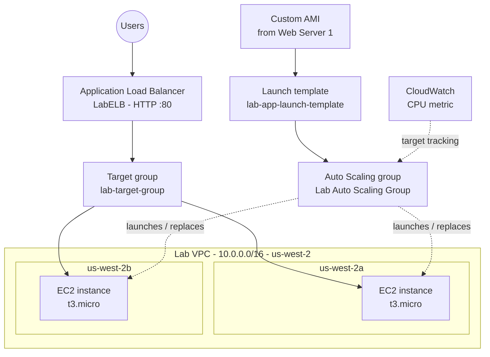
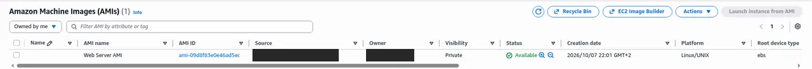
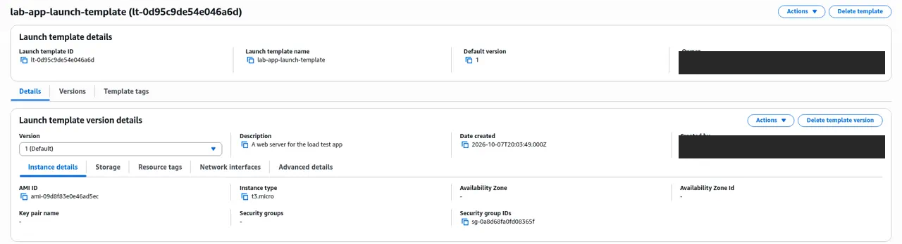
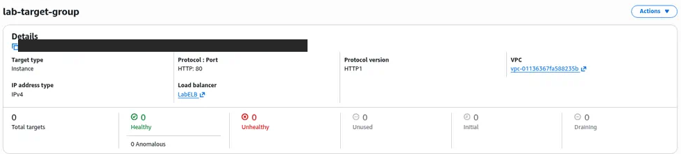
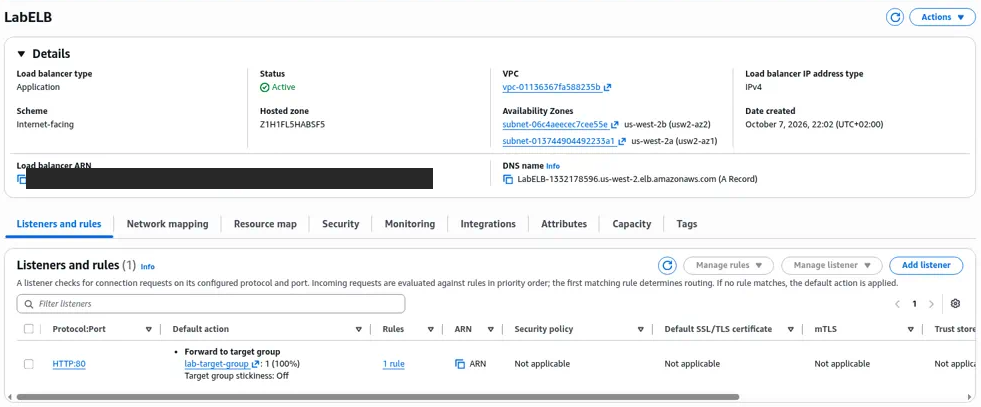
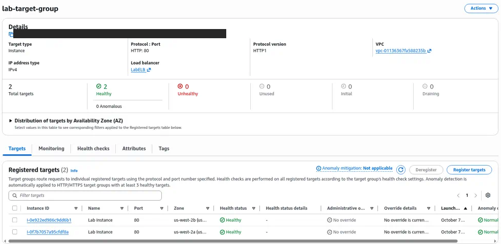

# Scale and Load Balance Your Architecture

> Turned a single web server into a self-healing, load-balanced fleet using an AMI, a launch template, an Application Load Balancer, and an Auto Scaling group across two Availability Zones.

---

## Overview

One server is a single point of failure. If it crashes or traffic spikes, the site goes down. Elasticity and high availability are among the main reasons companies move to AWS. This lab covers how they are built: traffic enters through a load balancer, instances are spread across Availability Zones, and Auto Scaling adds or replaces servers on its own.

Two re/Start labs cover this pattern:
- **Scale and Load Balance your Architecture** (console)
- **Using Auto Scaling in AWS (Linux)** (AWS CLI and console)

---

## Architecture

---

## What Was Built

**Lab: Scale and Load Balance your Architecture**
1. **Created an AMI** from a configured web server (`Web Server 1`), so every new instance starts with the application already installed
2. **Created a target group** (`lab-target-group`, instance targets, HTTP:80) in the Lab VPC
3. **Created an Application Load Balancer** (`LabELB`) across the public subnets of two Availability Zones, forwarding HTTP to the target group
4. **Created a launch template** (`lab-app-launch-template`): the custom AMI, `t3.micro`, and the web security group
5. **Created an Auto Scaling group** (`Lab Auto Scaling Group`) in the private subnets of both AZs, attached to the ALB target group, with a desired capacity of **2** and a **target-tracking scaling policy** on average CPU utilization
6. **Verified** that the new instances registered as healthy targets and that the app loaded through the load balancer's DNS name. Removed the original standalone server, leaving the Auto Scaling group to run the fleet.

**Lab: Using Auto Scaling in AWS (Linux)**
1. From a **Command Host** instance, used the **AWS CLI** to launch a web server with user data, then created an AMI from it
2. Built `web-app-launch-template` and the **Web App Auto Scaling Group** (min **2**, max **4**, desired **2**) across **Private Subnet 1** (`10.0.2.0/24`, us-west-2a) and **Private Subnet 2** (`10.0.4.0/24`, us-west-2b), behind a load balancer
3. **Real-world snag:** the Auto Scaling group failed validation with *"AMI … is pending, and cannot be run"*. Waited for the new AMI to become **available**, then created the group successfully.
4. Load-tested the app and watched CloudWatch alarms trigger a scale-out

---

## Services Used

| Service | Role |
|---|---|
| Amazon EC2 + AMI | Golden image of the web server |
| Launch templates | Versioned instance configuration for Auto Scaling |
| Elastic Load Balancing (ALB) | Single entry point; spreads HTTP across healthy targets |
| Target groups and health checks | Decides which instances receive traffic |
| Amazon EC2 Auto Scaling | Maintains desired capacity and scales out and in |
| Amazon CloudWatch | CPU metrics and alarms that drive scaling |
| AWS CLI | Scripted instance and AMI creation |

---

## Skills Demonstrated

Aligned to **CLF-C02**:

- **Domain 1: Cloud Concepts:** elasticity, scalability, high availability, and designing for failure (Well-Architected Reliability pillar)
- **Domain 3: Technology and Services:** EC2, AMIs, ELB, Auto Scaling, Availability Zones
- **Domain 4: Billing and Pricing:** paying only for the capacity in use by scaling in when load drops

Beyond CLF-C02: health checks, launch template versioning, and debugging Auto Scaling launch failures.

---

## Screenshots

> All screenshots come from temporary AWS re/Start lab accounts. Account IDs and usernames are cropped out.

*Custom AMI created from Web Server 1, status Available.*

*`lab-app-launch-template` with the custom AMI and `t3.micro`.*

*`lab-target-group` (HTTP:80) attached to `LabELB`.*

*Application Load Balancer `LabELB`, active across two Availability Zones.*

*`Lab Auto Scaling Group` at desired capacity: 2 healthy instances, min 2, max 4, across two Availability Zones.*

*Instances launched by Auto Scaling, registered as healthy targets.*

---

## Key Takeaways

- **The AMI and launch template are the blueprint.** Bake the app into the image so a new instance is ready to serve as soon as it boots.
- **Instances in private subnets, load balancer in public subnets.** Users only ever reach the ALB, so the servers stay off the internet.
- **Health checks make the system self-healing.** The target group stops routing to unhealthy instances, and Auto Scaling replaces them.
- **AMIs aren't usable the moment you create them.** Wait for the `available` state before an Auto Scaling group launches from one, or script it with `aws ec2 wait image-available`.
- **In production I would** add an HTTPS listener with an ACM certificate, tune health-check paths and grace periods, and add a scheduled or step policy for predictable traffic peaks.
