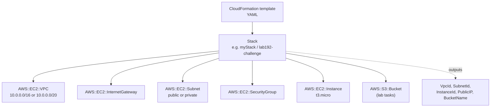
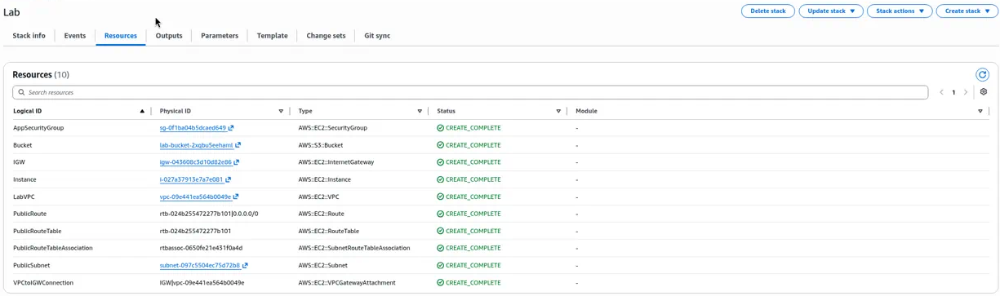
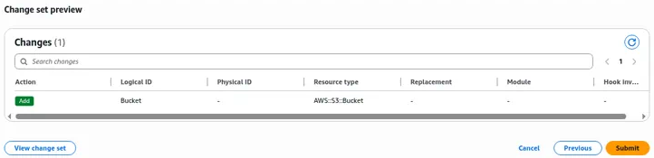
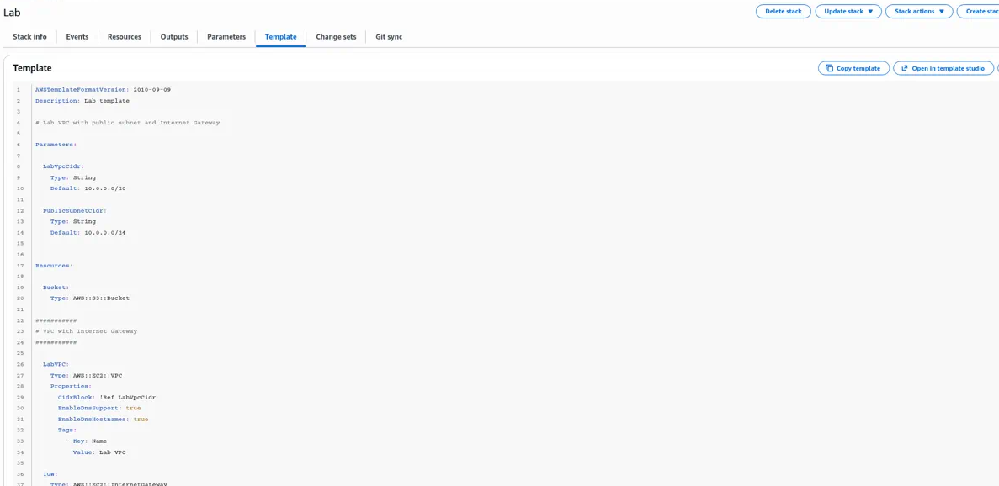
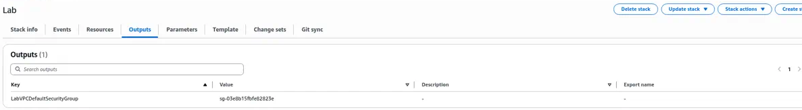

# Automating Deployments with AWS CloudFormation

> Built and updated CloudFormation stacks to create a VPC, security group, and EC2 instance from YAML. Troubleshot a failed stack with WaitConditions and S3 retention, then wrote a full challenge template from scratch.

---

## Overview

Clicking through the AWS console works for learning, but production infrastructure needs to be **repeatable, reviewable, and versioned**. CloudFormation is AWS's native infrastructure-as-code service: you declare resources in a template, and AWS creates, updates, and deletes them as a single stack.

This page covers three re/Start labs:
- **Automating Deployments with AWS CloudFormation** — grow a stack through several template versions
- **Troubleshooting AWS CloudFormation Deployments** — watch a stack fail, fix it, and delete a non-empty S3 bucket with retention
- **Challenge: CloudFormation** — write a complete template (VPC, IGW, private subnet, security group, EC2) and deploy it with the AWS CLI and boto3

---

## Architecture

---

## What Was Built

### Lab: Automating Deployments with AWS CloudFormation

Grew a stack through successive templates (saved locally as `task1.yaml` → `task3b.yaml`):

| Template | What was added |
|---|---|
| Task 1 | VPC (`10.0.0.0/20`), IGW, public route table (`0.0.0.0/0 → IGW`), public subnet (`10.0.0.0/24`, `MapPublicIpOnLaunch`), App security group (HTTP:80), stack outputs |
| Task 2 | Empty `AWS::S3::Bucket` resource |
| Task 3 | `t3.micro` EC2 instance in the public subnet, AMI resolved from the SSM Parameter Store path for the latest Amazon Linux 2 AMI |
| Task 3b | Switched the AMI parameter to a concrete `AWS::EC2::Image::Id` for a specific AMI |

Each version was applied with **Update stack** (reviewing the change preview first), and the **Events** and **Resources** tabs were checked after each change. The final task deleted the stack and confirmed every resource was removed.

### Activity: Troubleshooting AWS CloudFormation Deployments

1. Deployed a provided template as stack **`myStack`**. The first create rolled back after a **WaitCondition** timed out (the instance never signaled success).
2. Re-ran the create with `--on-failure DO_NOTHING` to keep the failed resources for inspection, read the Events with the CLI (`describe-stack-events`, `describe-stack-resources`), traced the failure to the instance user data (the Apache `httpd` install), fixed the template, and recreated the stack. Second attempt reached **CREATE_COMPLETE** and printed outputs: a public IP and a bucket name.
3. Induced **stack drift** by changing a security group outside the template, then detected it with CloudFormation drift detection.
4. Hit a real deletion failure: *"The bucket you tried to delete is not empty"*. Resolved it by deleting the stack with **`--retain-resources MyBucket`**, then emptying and removing the bucket separately.

### Challenge: CloudFormation

Wrote `lab192.yaml` from scratch and deployed it with a Python/boto3 script (`lab192_deploy.py`) in `us-west-2`:

- VPC `10.0.0.0/16` (**Lab192 VPC**), Internet Gateway, private subnet `10.0.1.0/24` (**Lab192 Private Subnet**)
- SSH security group (TCP 22)
- `t3.micro` instance (**Lab192 Web Server**) using the latest Amazon Linux 2 AMI from SSM Parameter Store
- Stack name `lab192-challenge`; outputs for VpcId, SubnetId, and InstanceId
- Script validated the template, created the stack, polled until complete, and printed failed events on error

---

## Services Used

| Service | Role |
|---|---|
| AWS CloudFormation | Declare, deploy, update, and delete stacks |
| Amazon VPC / EC2 / S3 | Resources created by the templates |
| AWS Systems Manager Parameter Store | Resolve the latest Amazon Linux AMI at deploy time |
| AWS CLI and boto3 | Validate, create, poll, and delete stacks from code |

---

## Skills Demonstrated

Aligned to **CLF-C02**:

- **Domain 3: Technology and Services:** CloudFormation as the AWS IaC service; stacks, templates, and change sets
- **Domain 1: Cloud Concepts:** automation and the value of repeatable infrastructure (Well-Architected Operational Excellence)

Beyond CLF-C02: intrinsic functions (`!Ref`, `!GetAtt`, `!Select`, `!GetAZs`), WaitConditions, drift detection, retained resources, and deploying with the AWS SDK.

---

## Screenshots

> All screenshots come from temporary AWS re/Start lab accounts. Account IDs and usernames are cropped out.

*The `Lab` stack after all updates: 10 resources (VPC, public subnet, internet gateway, route table and route, security group, S3 bucket and an EC2 instance), all CREATE_COMPLETE.*

*Reviewing a stack update before applying it: the change set preview shows exactly one change, adding the S3 bucket.*

*The stack's YAML template: parameters for the VPC and subnet CIDRs, the S3 bucket and the VPC with DNS support.*

*Stack outputs exposing the VPC's default security group ID for other stacks or scripts to use.*

---

## Key Takeaways

- **Templates are the source of truth.** If someone clicks in the console, drift detection shows the difference.
- **Failed creates teach more than successful ones.** WaitConditions, security group mistakes, and non-empty S3 buckets all produce clear Events that point at the fix.
- **Deletion needs a plan for stateful resources.** S3 buckets with objects (and RDS with deletion protection) often need retain-and-clean-up rather than a blind delete.
- **Resolve AMI IDs from SSM Parameter Store** so templates stay portable across Regions without hard-coding image IDs.
- **In production I would** keep templates in Git, review change sets before every update, use nested stacks or StackSets for multi-account work, and add stack policies to protect critical resources.
