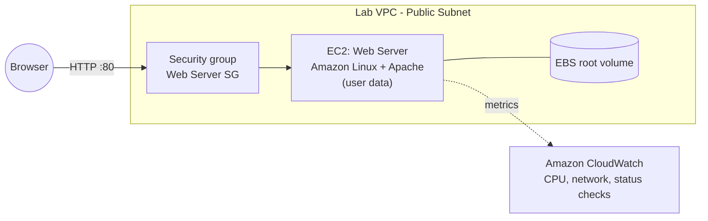
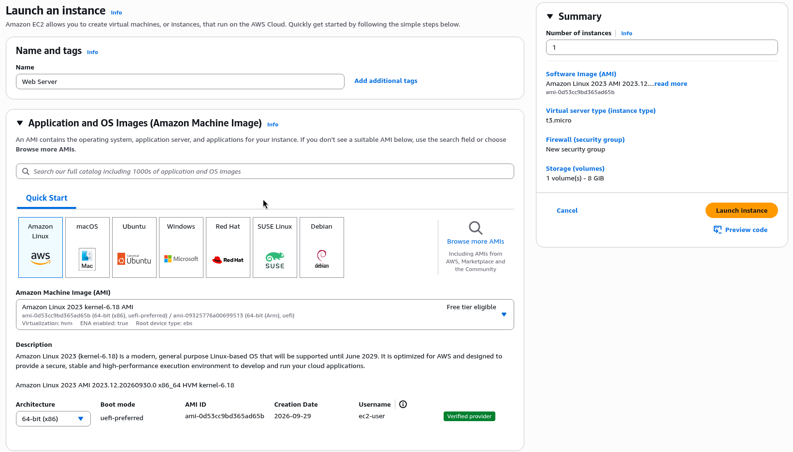
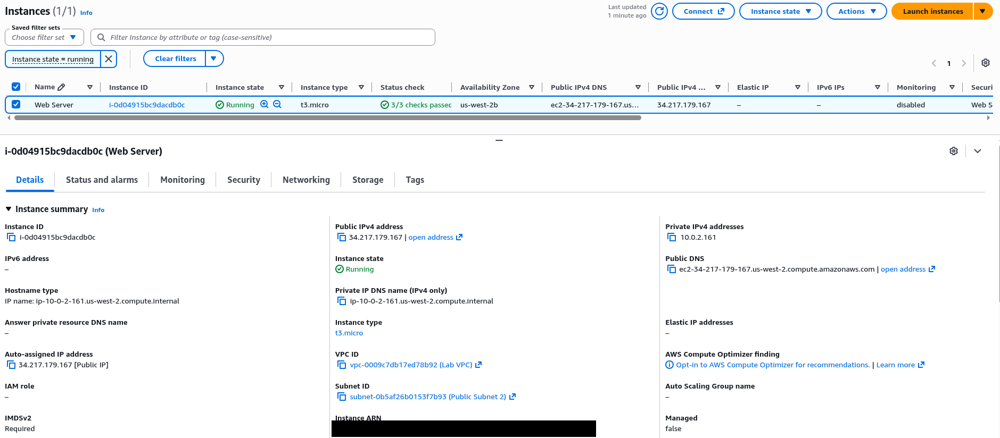
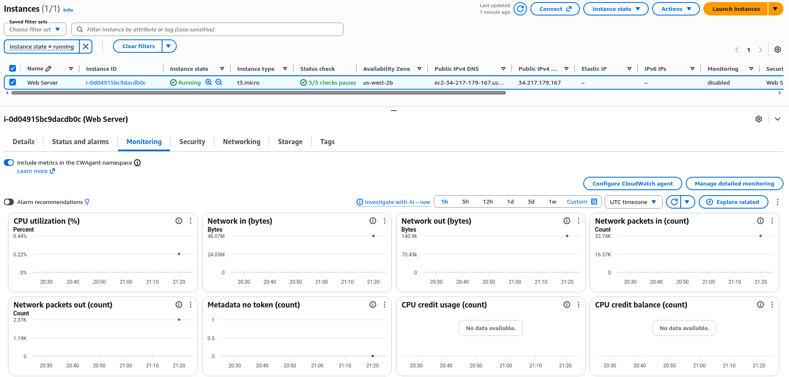
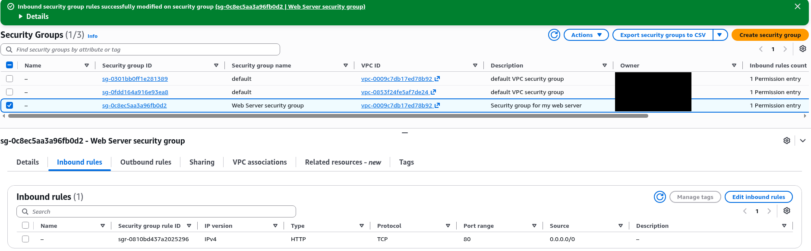
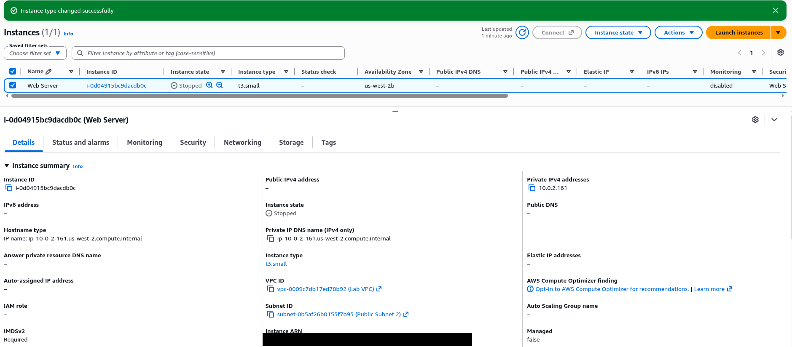
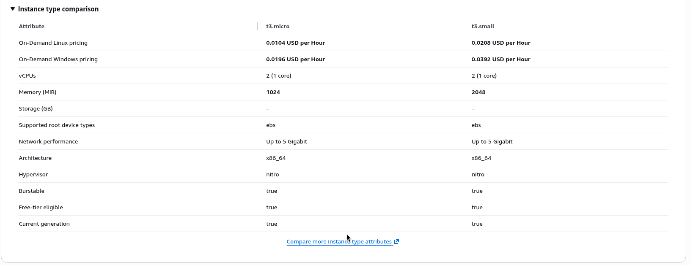
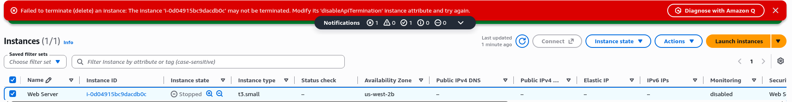
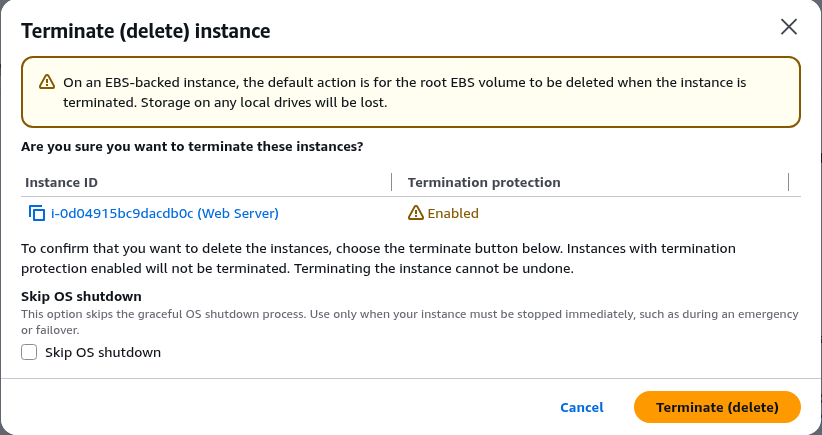

# Introduction to Amazon EC2

> Launched, secured, monitored, resized, and safely terminated a web server on Amazon EC2. These are the core lifecycle tasks behind most AWS workloads.

---

## Overview

This lab provided a basic overview of launching, resizing, managing, and monitoring an Amazon EC2 instance.

Amazon Elastic Compute Cloud (Amazon EC2) is a web service that provides resizable compute capacity in the cloud. It was designed to make web-scale cloud computing easier for developers.

Amazon EC2's simple web service interface lets you obtain and configure capacity with minimal friction. It provides complete control of computing resources and runs workloads on Amazon's proven computing environment. EC2 cuts the time needed to obtain and boot new server instances to minutes, so capacity can scale up and down quickly as requirements change.

Amazon EC2 changed the economics of computing by allowing payment only for capacity that was actually used. It provides developers with the tools to build failure-resilient applications and isolate them from common failure scenarios.

**Why it matters to employers:** nearly every cloud support ticket touches EC2 at some point. Typical issues are an instance that won't start, a website that won't load, or a server that needs more capacity. This lab covers each of those tasks directly.

---

## Architecture

---

## Topics Covered

The following objectives were completed during this lab:

- Launched a web server with termination protection enabled
- Monitored the EC2 instance
- Modified the security group to allow HTTP access
- Resized the Amazon EC2 instance to scale
- Tested termination protection
- Terminated the EC2 instance

---

## What Was Built

1. **Launched `Web Server`** on Amazon Linux into the **Lab VPC's public subnet**, with a **user data** script that installs and starts Apache. **Termination protection** was enabled at launch.
2. **Monitored the instance** with EC2 **status checks**, the **CloudWatch** monitoring tab (CPU utilization, network), the **system log**, and an instance **screenshot**
3. **Opened HTTP:** the page didn't load at first because the security group had no HTTP rule. Added an inbound **HTTP (port 80)** rule, and the test page loaded at the public IP.
4. **Resized the instance:** stopped it, changed the **instance type** from a micro to a **small** size, **increased the EBS root volume**, and started it again
5. **Tested termination protection:** an attempt to terminate was blocked. Turned the protection off, then **terminated** the instance cleanly.

---

## Key Features of Amazon EC2

| Feature | Description |
|---|---|
| Cloud-based | Resizable compute capacity delivered via the web |
| Fully configurable | Complete control over computing resources |
| Fast provisioning | New instances booted and ready in minutes |
| Pay as you go | Billed only for capacity actually used |

---

## Skills Demonstrated

Aligned to **CLF-C02**:

- **Domain 3: Technology and Services:** EC2 instance types, AMIs, EBS volumes, user data, and the instance lifecycle (stop / start / terminate)
- **Domain 2: Security and Compliance:** security groups as stateful firewalls; termination protection as a safeguard
- **Domain 4: Billing and Pricing:** right-sizing instances; paying only while instances run

---

## Screenshots

> All screenshots come from temporary AWS re/Start lab accounts. Account IDs and usernames are cropped out.

*Launching `Web Server`: Amazon Linux 2023 AMI on a `t3.micro` with an 8 GiB volume and a new security group.*

*`Web Server` running in the Lab VPC's public subnet with 3/3 status checks passed.*

*The instance's Monitoring tab: CloudWatch CPU, network and packet graphs.*

*`Web Server security group` after the fix: SSH removed and HTTP (TCP 80) allowed, so the site loads.*

*Resized from `t3.micro` to `t3.small` while stopped.*

*Comparing the two sizes before resizing: double the memory for double the hourly price.*

*Termination protection doing its job: the console refuses to delete the instance.*

*The terminate dialog flags termination protection as Enabled.*

---

## Key Takeaways

- **Security groups deny by default.** A web server is unreachable until you explicitly allow its port.
- **Vertical scaling needs a stop.** Changing the instance type means downtime, which is one reason to design for horizontal scaling ([see Scale and Load Balance](../Architecture/Scale-and-Load-Balance.md)).
- **Termination protection is cheap insurance** against deleting the wrong server.
- **User data automates first boot.** The server was configured on launch, not by hand.
