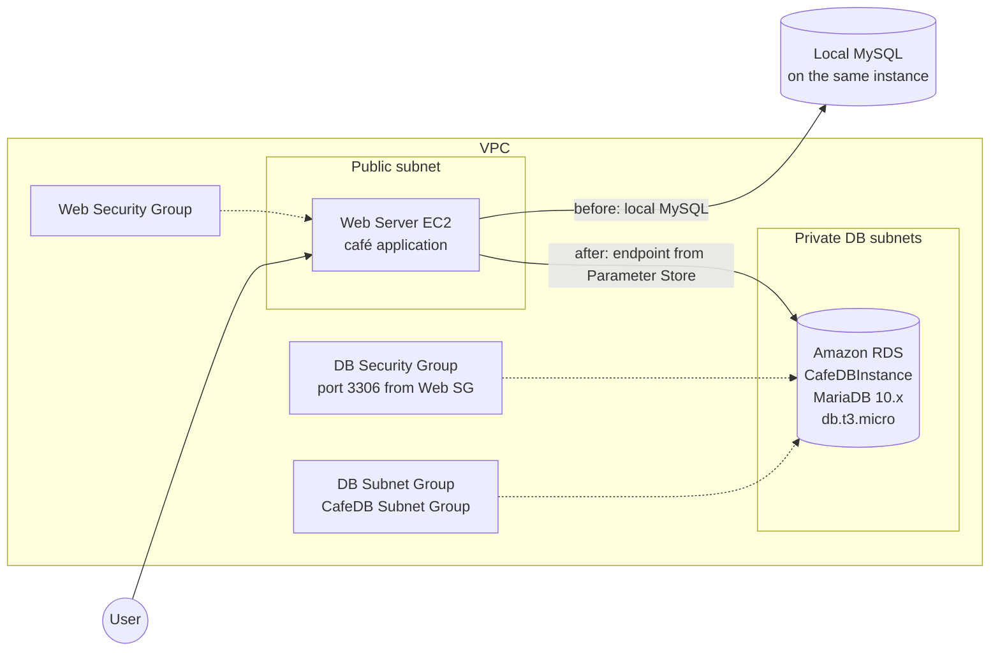
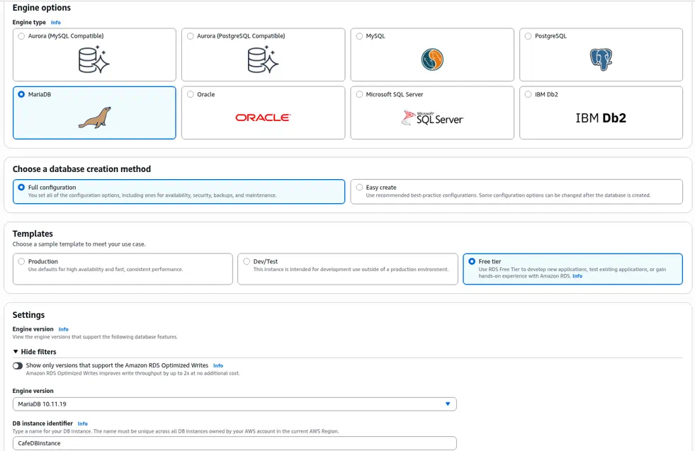
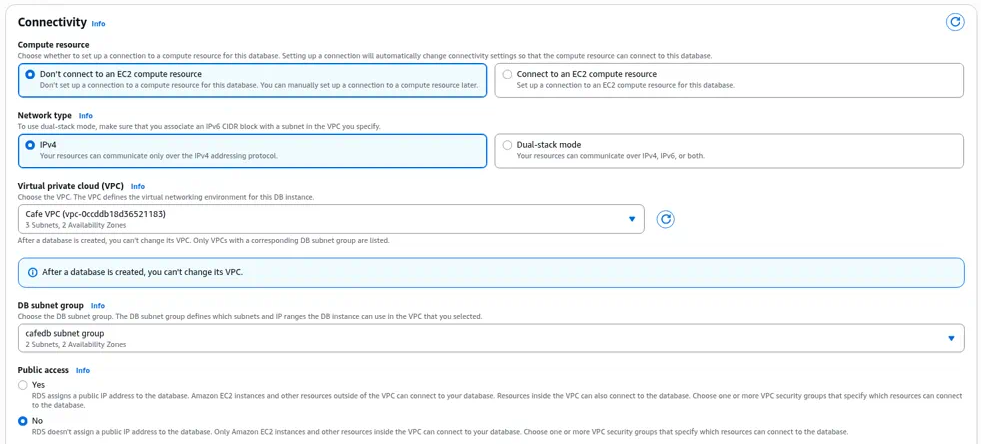
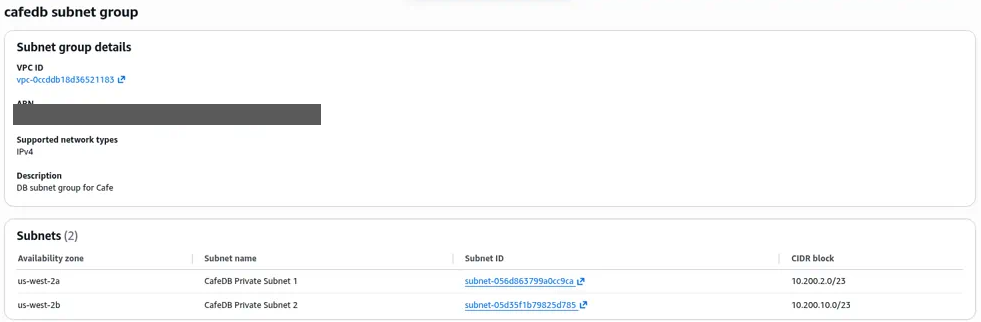
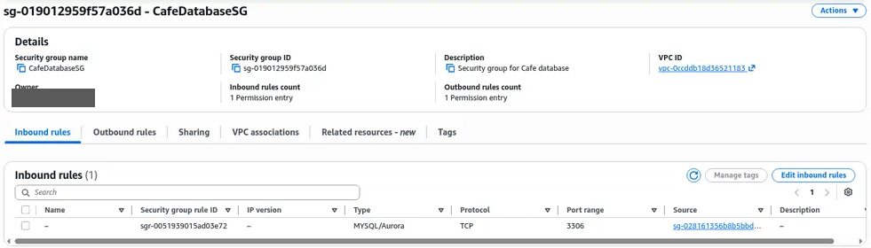
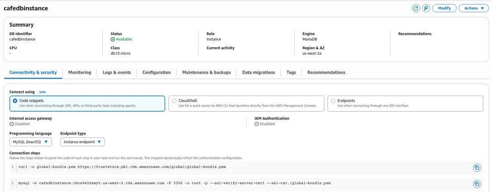
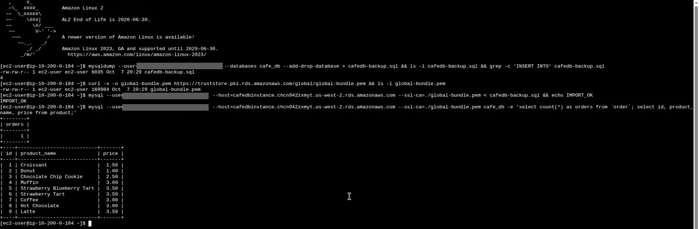

# Migrate to Amazon RDS

> Moved a café web application's database from a local MySQL install on the web server onto a private, managed MariaDB instance on Amazon RDS. The app kept running; only the connection string changed.

---

## Overview

Running a database on the same EC2 instance as the application works for a lab, but not for production. That pattern mixes compute and data, makes patching risky, and has no managed backups or Multi-AZ failover. Amazon RDS provides a managed relational database: AWS handles OS patching, backups, and optional Multi-AZ failover, while you still own schema and queries.

This page covers the **Migrate to Amazon RDS** lab and the related database track: building an RDS MySQL instance, writing SQL with the CLI, and (in a later lab) connecting a Lambda function to RDS through VPC.

---

## Architecture

---

## What Was Built

**Lab: Migrate to Amazon RDS**
1. **Inspected the source database** on the café web server, then exported it with `mysqldump`
2. **Created a DB subnet group** (`CafeDB Subnet Group`) spanning private subnets in two Availability Zones
3. **Created a DB security group** that allows inbound MySQL/MariaDB (port **3306**) only from the web server's security group
4. **Launched `CafeDBInstance` with the AWS CLI** (`aws rds create-db-instance`):
   - Engine: **MariaDB 10.11**
   - Class: **`db.t3.micro`**, 20 GiB storage
   - Placement: Availability Zone `us-west-2a`, **not publicly accessible**
   - Attached the DB subnet group and DB security group
5. **Waited for the instance to become available** (`aws rds wait db-instance-available`), then noted the endpoint, backup window, and retention settings
6. **Imported the dump** into the RDS instance and **pointed the café application** at the new endpoint by updating its database URL in Systems Manager Parameter Store
7. **Verified** that the café website still worked and was now reading from and writing to RDS

**Related labs**
- **Build Your DB Server and Interact with Your DB Using an App:** launched an RDS MySQL instance with high-availability settings, allowed access from the web server's security group, and used the companion web app to read and write records
- **Challenge: Build and Access an RDS Server:** launched an RDS MySQL instance (`restart-db`), connected from a Linux host, and wrote SQL from the command line: created `RESTART` and `CLOUD_PRACTITIONER` tables, inserted rows, and queried them with an `INNER JOIN`
- **Working with AWS Lambda:** connected a Lambda function (`salesAnalysisReportDataExtractor`) to an RDS database through a VPC attachment and Parameter Store credentials

---

## Services Used

| Service | Role |
|---|---|
| Amazon RDS (MariaDB / MySQL) | Managed relational database |
| DB subnet groups | Place the DB in private subnets across AZs |
| Security groups | Allow port 3306 only from the web tier |
| Amazon EC2 | Host of the café application and the source MySQL database |
| mysqldump / MySQL client | Export, import, and verify data |
| AWS Systems Manager Parameter Store | Holds the app's DB connection settings (`/cafe/...` parameters) |
| AWS CLI | Created and waited on the RDS instance from a command host |

---

## Skills Demonstrated

Aligned to **CLF-C02**:

- **Domain 3: Technology and Services:** Amazon RDS vs. a database on EC2; Multi-AZ and subnet groups; engine choices (MySQL, MariaDB, Aurora, DynamoDB covered in adjacent labs)
- **Domain 2: Security and Compliance:** private placement (`PubliclyAccessible = false`); least-privilege security groups; separating credentials from application code

Beyond CLF-C02: `mysqldump` migrations, connection-endpoint cutover, RDS through the AWS CLI, and SQL (CREATE, INSERT, SELECT with INNER JOIN).

---

## Screenshots

> All screenshots come from temporary AWS re/Start lab accounts. Account IDs and usernames are cropped out.

*Create database wizard for `CafeDBInstance`: MariaDB engine, full configuration.*

*Connectivity settings: Cafe VPC, the private DB subnet group across two AZs, and Public access set to No.*

*`CafeDB Subnet Group` spanning private subnets in us-west-2a (`10.200.2.0/23`) and us-west-2b (`10.200.10.0/23`).*

*`CafeDatabaseSG` inbound rule: MySQL/Aurora (3306) allowed only from the app's security group, not the internet.*

*`cafedbinstance` Available on `db.t3.micro`, with the connection endpoint and TLS connection snippet.*

*On the app server: `mysqldump` of `cafe_db`, import into RDS over TLS, then a query against RDS confirming the orders and all 9 products migrated.*

---

## Key Takeaways

- **Managed databases reduce undifferentiated work.** Backups, patching, and Multi-AZ failover are configuration choices, not late-night ops scripts.
- **Security groups are the firewall for RDS.** Source the DB security group from the web security group (not `0.0.0.0/0`), and leave the instance private.
- **Migration is mostly connection and dump/restore.** The application code barely changed; the connection endpoint and credentials did.
- **In production I would** enable Multi-AZ for failover, turn on automated backups and encryption at rest, store credentials in Secrets Manager, and put the application behind an ALB with the database in private subnets only.
