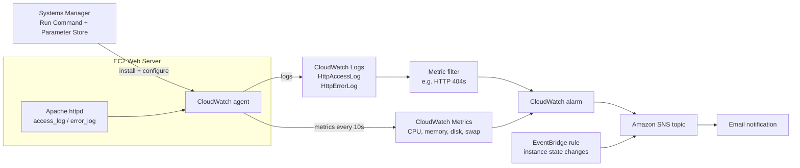
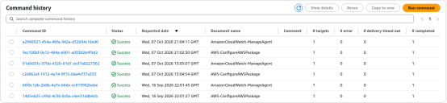
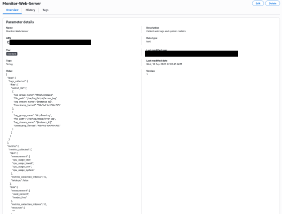
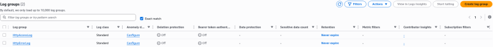
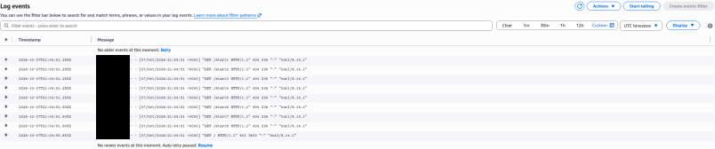
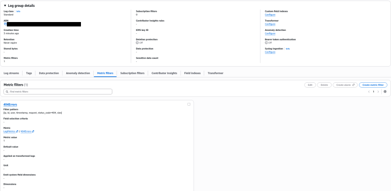
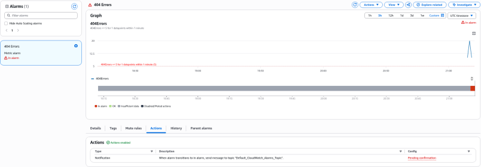
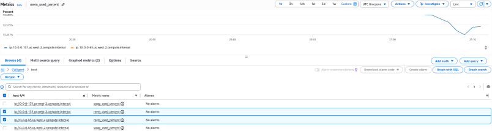
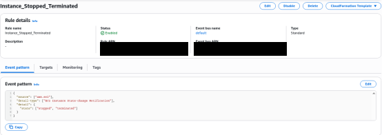
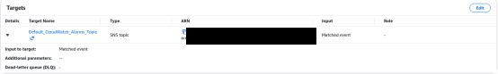

# Monitoring Infrastructure with Amazon CloudWatch

> Installed the CloudWatch agent on a web server through Systems Manager, sent Apache logs and OS metrics to CloudWatch, turned log patterns into alarms, and sent alerts through Amazon SNS.


---

## Overview

Infrastructure that nobody watches fails without anyone noticing. Cloud support and operations roles spend much of their time on monitoring: finding out *before* customers do that a disk is filling up, a server stopped, or a website is returning errors. Default EC2 metrics cover CPU and network but **not memory, disk usage, or application logs**. The CloudWatch agent fills that gap.

This page covers the **Monitoring Infrastructure** lab, plus related monitoring work from the security and serverless labs.

---

## Architecture



---

## What Was Built

**1. Agent installation through Systems Manager (no SSH)**
- Used **Systems Manager Run Command** to install the **Amazon CloudWatch agent** on the web server
- Stored the agent configuration as a JSON document in **Parameter Store**, then used Run Command to start the agent with that configuration

**2. Agent configuration (actual config used)**
- **Logs:** Apache `/var/log/httpd/access_log` → log group **`HttpAccessLog`**; `/var/log/httpd/error_log` → **`HttpErrorLog`**, one log stream per instance ID
- **Metrics (10-second interval):** CPU (idle, iowait, user, system), disk `used_percent` and `inodes_free`, disk I/O time, `mem_used_percent`, `swap_used_percent`

```json
{
  "logs": { "logs_collected": { "files": { "collect_list": [
    { "log_group_name": "HttpAccessLog", "file_path": "/var/log/httpd/access_log", "log_stream_name": "{instance_id}" },
    { "log_group_name": "HttpErrorLog",  "file_path": "/var/log/httpd/error_log",  "log_stream_name": "{instance_id}" }
  ]}}},
  "metrics": { "metrics_collected": {
    "cpu":  { "measurement": ["cpu_usage_idle","cpu_usage_iowait","cpu_usage_user","cpu_usage_system"], "metrics_collection_interval": 10 },
    "disk": { "measurement": ["used_percent","inodes_free"], "metrics_collection_interval": 10, "resources": ["*"] },
    "mem":  { "measurement": ["mem_used_percent"], "metrics_collection_interval": 10 },
    "swap": { "measurement": ["swap_used_percent"], "metrics_collection_interval": 10 }
  }}
}
```
*(Trimmed version of the configuration used; the full config also collected disk I/O time.)*

**3. Logs to alarms**
- Generated traffic, including requests for pages that don't exist, and checked the entries in **CloudWatch Logs**
- Created a **metric filter** on `HttpAccessLog` that counts HTTP 404 responses, and a **CloudWatch alarm** on that metric
- Routed the alarm to an **SNS topic** with an email subscription

**4. Event-driven notifications**
- Created an **EventBridge rule** for EC2 instance state changes, targeting the same SNS topic (the topic access policy allows `events.amazonaws.com` to publish)
- Stopped the instance to trigger a notification end to end

**Related monitoring work**
- **Monitor an EC2 Instance** (security track): built a CloudWatch alarm on `CPUUtilization` (threshold ≥ 60%) with an SNS action, then ran a stress test to put it into ALARM
- **AWS Lambda Exercise:** reviewed function output in the `/aws/lambda/WordCountFunction` log group
- **Working with AWS CloudTrail:** used CloudTrail to find which API call changed a security group

---

## Services Used

| Service | Role |
|---|---|
| Amazon CloudWatch Metrics | OS-level metrics from the agent plus default EC2 metrics |
| Amazon CloudWatch Logs | Centralized Apache access and error logs |
| CloudWatch metric filters and alarms | Turn log patterns and thresholds into alerts |
| Amazon SNS | Email notifications |
| Amazon EventBridge | React to EC2 state-change events |
| AWS Systems Manager (Run Command, Parameter Store) | Install and configure the agent without SSH |

---

## Skills Demonstrated

Aligned to **CLF-C02**:

- **Domain 3: Technology and Services:** CloudWatch (metrics, logs, alarms, dashboards), SNS, EventBridge, Systems Manager
- **Domain 2: Security and Compliance:** CloudTrail for auditing compared with CloudWatch for monitoring; managing servers without opening SSH
- **Domain 1: Cloud Concepts:** Operational Excellence pillar (observability and automated responses)

Beyond CLF-C02: CloudWatch agent JSON configuration, metric filters on web logs, and alarm states (OK / ALARM / INSUFFICIENT_DATA).

---

## Screenshots

> All screenshots come from temporary AWS re/Start lab accounts. Account IDs, usernames, and email addresses are cropped out.


*Systems Manager Run Command history: `AWS-ConfigureAWSPackage` installed the CloudWatch agent and `AmazonCloudWatch-ManageAgent` configured and restarted it, all with no SSH.*


*The agent configuration stored in Parameter Store as `Monitor-Web-Server`: Apache access and error logs, plus CPU and disk metrics.*


*The agent shipping Apache logs into two CloudWatch log groups, `HttpAccessLog` and `HttpErrorLog`.*


*Access log events from the web server: test requests to missing pages logged as 404s (client IP redacted).*


*The `404Errors` metric filter: it parses each access log line and publishes a count to `LogMetrics/404Errors`.*


*The `404 Errors` alarm firing: the metric spiked past the threshold of 5 in one minute, and the alarm's action notifies an SNS topic.*


*Custom `CWAgent` metrics: memory used percent per host, which default EC2 monitoring doesn't collect.*


*EventBridge rule `Instance_Stopped_Terminated`, matching EC2 instances that change to stopped or terminated.*


*The rule's target: the same SNS topic, so the team is emailed when an instance stops.*

---

## Key Takeaways

- **Default EC2 metrics aren't enough.** Memory and disk usage need the CloudWatch agent, and so do application logs.
- **Logs become metrics, and metrics become alarms.** Metric filters bridge raw log lines and actionable alerts.
- **Systems Manager scales better than SSH.** One Run Command can configure a whole fleet, with no keys or open ports.
- **Watch both events and metrics.** EventBridge catches state changes immediately, while alarms catch gradual trends.
- **In production I would** build a shared CloudWatch dashboard per service, alert to a team channel or on-call tool through SNS, and set log retention to control cost.
