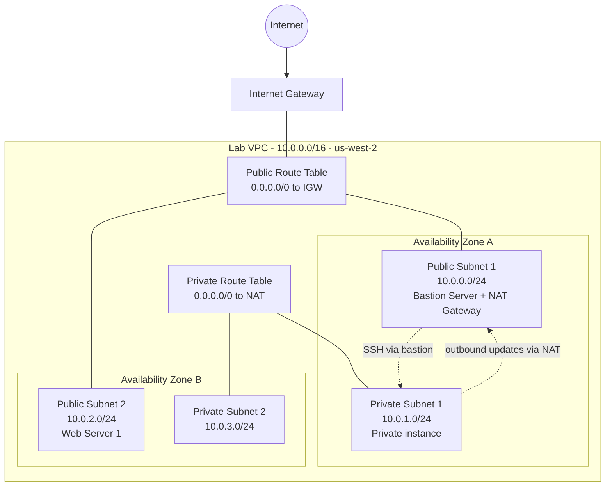
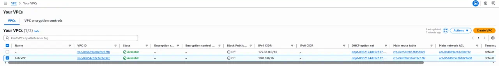
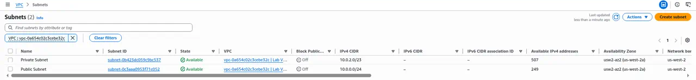
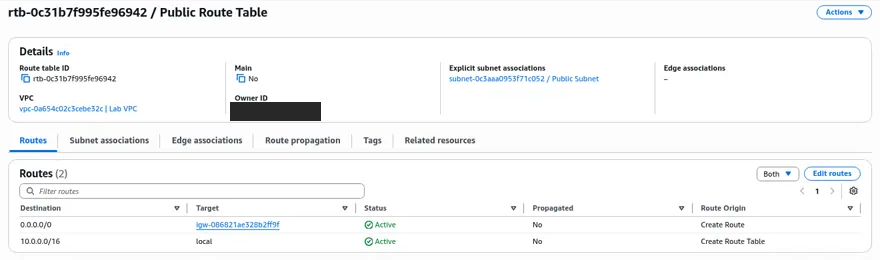
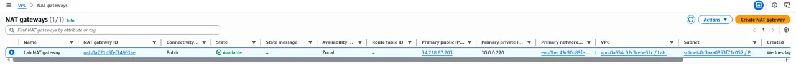
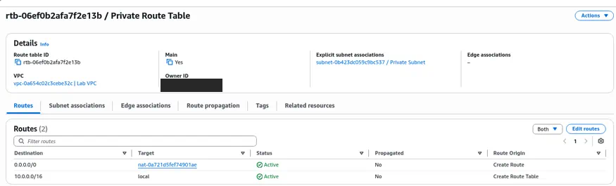
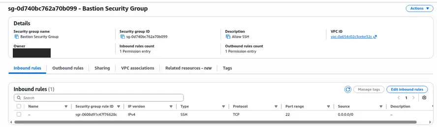

# Configuring an Amazon VPC

> Built a private network on AWS from scratch, with public and private subnets, internet and NAT gateways, route tables, and security controls. Then fixed a VPC whose web server couldn't be reached.

---

## Overview

Almost every AWS workload runs inside a Virtual Private Cloud (VPC). A VPC defines what can reach the internet, what stays private, and how traffic moves between tiers. Most production incidents and security findings come back to networking: a missing route, a security group that is too open, or a database sitting in a public subnet.

This page covers the networking track of AWS re/Start, which ended with the **Configuring an Amazon VPC** lab. The same design was built more than once:

- **Configuring an Amazon VPC:** build a VPC by hand and add a bastion host and a NAT gateway
- **Build your VPC and Launch a Web Server:** use the VPC wizard for a two-AZ, two-tier VPC, then launch a web server
- **Networking Resources for a VPC:** build the route tables, network ACLs, and security groups by hand
- **Troubleshoot a VPC:** find and fix a broken route

---

## Architecture

---

## What Was Built

**1. VPC and subnets**
- Created **Lab VPC** with the CIDR block `10.0.0.0/16`, with DNS hostnames enabled
- Split it into public subnets (`10.0.0.0/24`, `10.0.2.0/24`) and private subnets (`10.0.1.0/24`, `10.0.3.0/24`) across two Availability Zones in `us-west-2`
- Earlier networking labs practiced CIDR planning on smaller ranges, for example a `192.168.0.0/18` VPC with a `/26` public subnet

**2. Internet access**
- Created and attached an **internet gateway** to the VPC
- Built a **Public Route Table** with a `0.0.0.0/0 → igw-…` route and associated it with the public subnets
- Created a **NAT gateway** in Public Subnet 1 with an Elastic IP. The private route table sends `0.0.0.0/0` to the NAT, so private instances can download updates without being reachable from the internet.

**3. Compute and access**
- Launched a **Bastion Server** in the public subnet as the only SSH entry point, and reached a private instance through it
- Launched **Web Server 1** (Amazon Linux, Apache from user data) in Public Subnet 2 with a **Web Security Group** that allows HTTP (port 80)
- Configured **network ACLs** (stateless, subnet level) and **security groups** (stateful, instance level) and compared how they behave

**4. Troubleshooting: Troubleshoot a VPC and Troubleshooting a Network Issue**
- A web server in a `10.0.0.0/16` VPC couldn't be reached. Its route table only had the `local` route.
- Diagnosed with the AWS CLI (`describe-route-tables`), `nmap`, and `curl`. Fixed it by adding a `0.0.0.0/0` route to the internet gateway (`aws ec2 create-route`). The server then returned its `Hello From Your Web Server!` page.
- In a second lab, the web page was down for two reasons: Apache (`httpd`) was stopped, and the security group only allowed port 22. Started the service with `systemctl` and opened port 80.

---

## Services Used

| Service / feature | Role in this lab |
|---|---|
| Amazon VPC | Isolated network, subnets, route tables, network ACLs |
| Internet gateway | Two-way internet access for public subnets |
| NAT gateway + Elastic IP | Outbound-only internet access for private subnets |
| Amazon EC2 | Bastion host, private instance, and web server |
| Security groups | Stateful instance firewall (SSH 22, HTTP 80) |
| AWS CLI | Inspecting and fixing routes from the command line |

---

## Skills Demonstrated

Aligned to **AWS Certified Cloud Practitioner (CLF-C02)**:

- **Domain 3: Cloud Technology and Services:** VPC components (subnets, route tables, IGW, NAT gateway); Regions and Availability Zones
- **Domain 2: Security and Compliance:** security groups compared with network ACLs; keeping workloads in private subnets; a bastion host as a controlled entry point
- **Domain 1: Cloud Concepts:** designing across two AZs for high availability

Beyond CLF-C02: CIDR planning, layered troubleshooting (route → firewall → service), and Linux network tools (`ping`, `traceroute`, `netstat`, `curl`, `nmap`).

---

## Screenshots

> All screenshots come from temporary AWS re/Start lab accounts. Account IDs and usernames are cropped out.

*Lab VPC (`10.0.0.0/16`) in the VPC console.*

*Public (`10.0.0.0/24`) and private (`10.0.2.0/23`) subnets in the Lab VPC.*

*Public Route Table with `0.0.0.0/0` pointing to the internet gateway.*

*NAT gateway in the public subnet, status Available.*

*Private route table sending `0.0.0.0/0` to the NAT gateway.*

*Bastion Security Group allowing SSH (TCP 22) inbound.*

---

## Key Takeaways

- **"Public" is a routing decision, not a setting.** A subnet is public only because its route table points `0.0.0.0/0` to an internet gateway.
- **NAT gateways allow outbound traffic only.** Private instances can reach the internet for patches, but nothing on the internet can open a connection to them.
- **Troubleshoot one layer at a time:** route table, then NACL, then security group, then whether the service is running. Every connectivity fix in these labs came from working through that order.
- **In production I would** restrict bastion SSH to known IP ranges (or replace it with Systems Manager Session Manager), run one NAT gateway per AZ for resilience, and keep databases in private subnets only.
