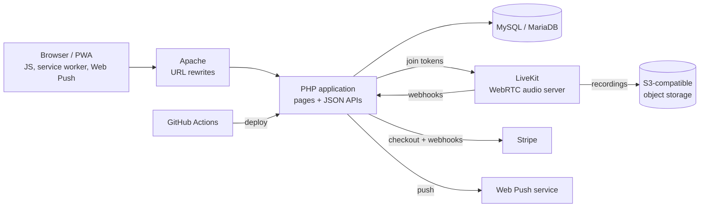

# Backend Contributor: Live Social Audio Platform

> I'm a backend contributor on a live, production social platform with live audio rooms, direct messages, stories and paid subscription tiers. The product is a private codebase with a small team, so this page describes my work without naming the product or sharing code.

**Stack:** PHP 8 · MySQL / MariaDB (PDO, prepared statements) · LiveKit (WebRTC) · WebAudio · Stripe · Web Push · WebAuthn · GitHub Actions

---

## At a Glance

- **428 commits** to a production codebase between June and October 2026
- The codebase has **800+ merged pull requests** and **100+ JSON API endpoints**, shipped to real users through separate sandbox and production environments
- I owned features end to end: database schema, API endpoints, permission checks and the front-end wiring

---

## Architecture

---

## What I Built

### Security
- **Passkey sign-in (WebAuthn).** Added fingerprint and passkey login as an optional second factor, with server-side challenge checks and replay protection.
- **XSS fix in live-room chat.** Found and closed a cross-site scripting hole where chat messages weren't properly escaped.
- **Session hardening.** The session ID now regenerates after a password change, so an old stolen session can't carry over. Also worked on security headers and a security review.

### Live audio rooms
- **Private rooms with host approval.** Listeners request to join and the host approves or denies them, enforced on the server, not just hidden in the UI.
- **Co-host moderation.** Hosts can promote co-hosts who share moderation powers.
- **Kick detection.** A removed user's client notices it has been removed and leaves the room cleanly instead of getting stuck.
- **Audio quality.** Applied noise cancellation to the raw microphone before the WebAudio pipeline. Added adaptive bandwidth (DTX/RED and a bitrate ladder from 64 kbps down to 10 kbps), so audio holds up on weak mobile connections.

### Messaging and social features
- **Group direct messages.** Built group conversations from the data model up: membership, unread counts and the API.
- **Stories with privacy rules.** Users choose who can see their stories and whose stories they see, and admin overrides are scoped carefully.
- **Games and engagement.** Daily word games with streaks and leaderboards, and synced watch-party playback.

### Payments
- **Stripe subscription tiers.** Created Stripe products and prices for a paid tier and wired tier selection into checkout.

---

## How I Work
- **Branch per feature, pull request per change**, with hotfix branches for production issues
- **Sandbox first, then production.** Changes deploy automatically through GitHub Actions to a sandbox environment before going live.
- **Security by default.** Prepared statements for every query, permission checks on the server, and escaping on output

---

## How This Maps to AWS
These are the cloud concepts I use here and their AWS equivalents.

| In this project | AWS equivalent |
|---|---|
| S3-compatible object storage for recordings | Amazon S3 |
| Webhook-driven events (audio server, payments) | Amazon EventBridge, AWS Lambda, Amazon API Gateway |
| Web Push notifications | Amazon SNS |
| Passkeys and two-factor sign-in | Amazon Cognito (MFA, passkeys) |
| CI/CD to sandbox and production | AWS CodePipeline, AWS CodeDeploy |
| Managed MySQL | Amazon RDS for MySQL / MariaDB |

*Code and product details are private. Happy to walk through the architecture and my contributions in an interview.*
