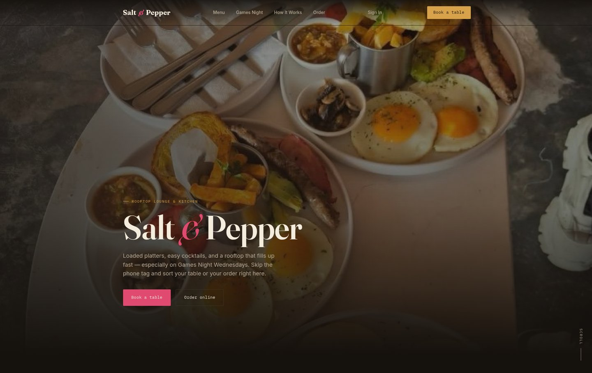
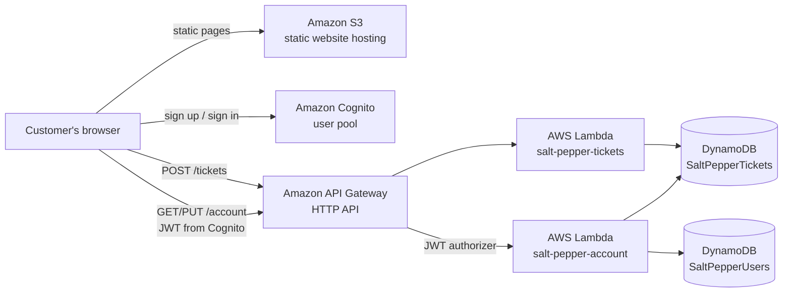
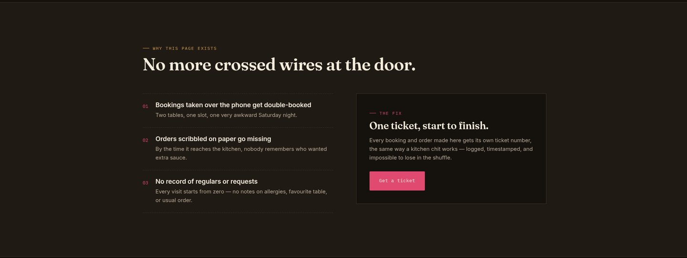
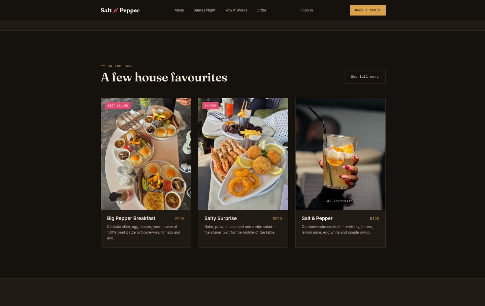
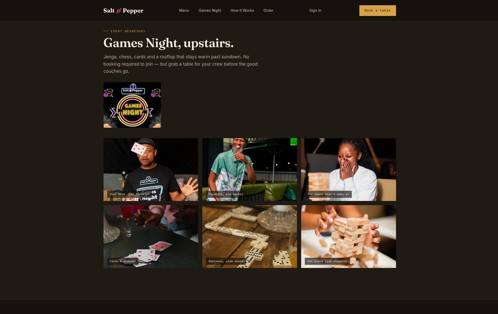
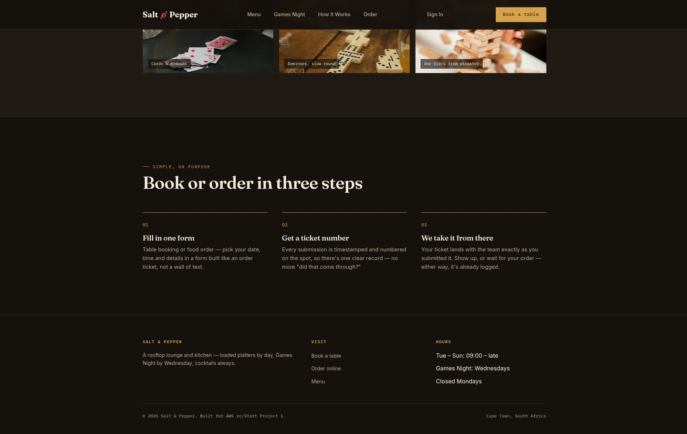
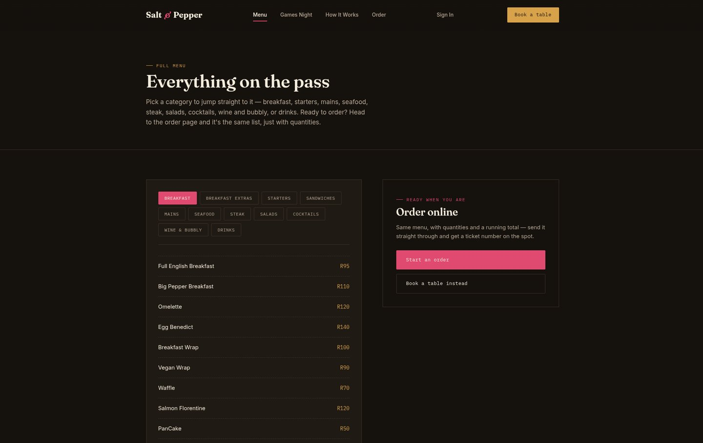
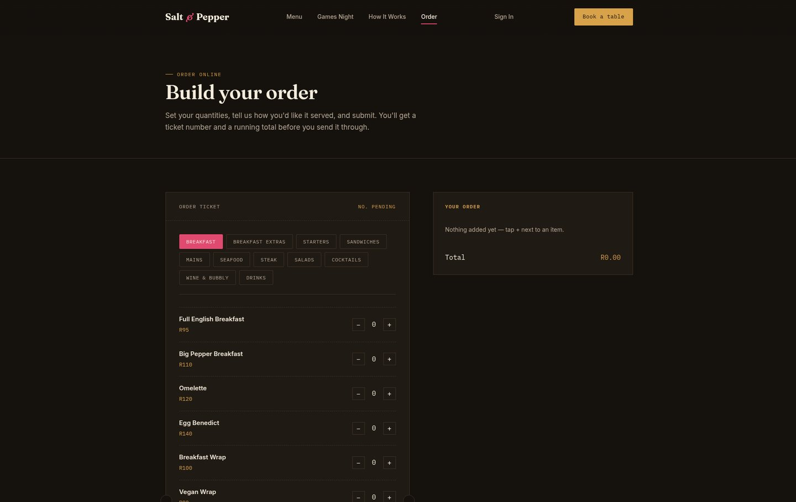
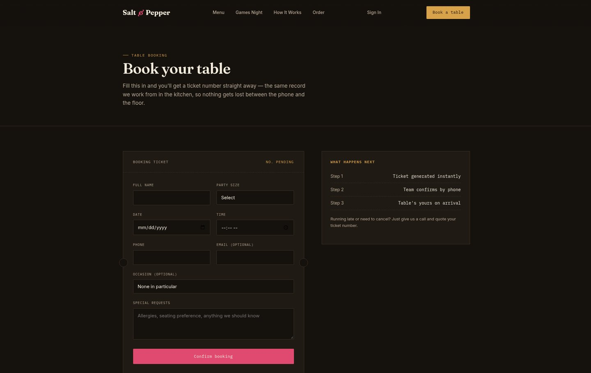
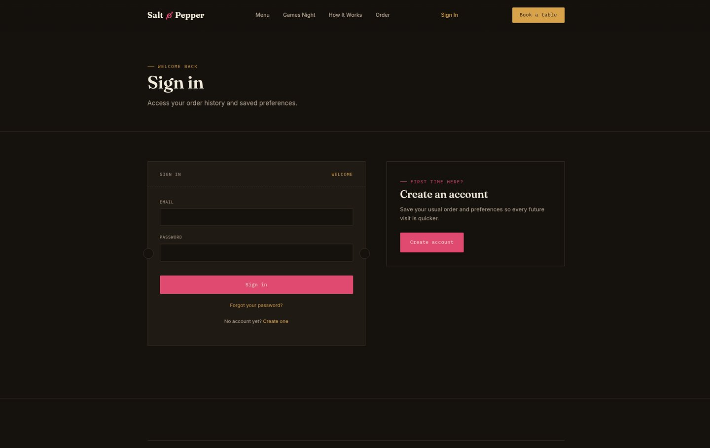

# Salt & Pepper: Restaurant Booking and Ordering Site (AWS re/Start Project)

> A booking and online-ordering site for a rooftop lounge and kitchen. Every booking and order gets its own ticket number, so nothing gets lost between the door and the kitchen. The front end is live, and the serverless AWS backend is designed and code-ready.

**Live site:** [awssaltpepper.netlify.app](https://awssaltpepper.netlify.app/)

---

## The Problem

The restaurant took bookings over the phone and orders on paper. That caused three recurring problems:

1. **Double bookings.** Two tables, one slot, one very awkward Saturday night.
2. **Lost orders.** Paper slips went missing before they reached the kitchen.
3. **No customer history.** Every visit started from zero, with no notes on allergies, favourite tables or usual orders.

## The Solution

One web form for table bookings and one for food orders. Each submission becomes a numbered, timestamped **ticket** (like a kitchen chit), stored in a database so there's one clear record of every request. Customers can create an account to see their order history and save preferences.

---

## Architecture

The site is built to run fully serverless on AWS, with no servers to patch and costs that scale to zero when nobody is using it.

| Service | Role in the design |
|---|---|
| **Amazon S3** | Hosts the static site (HTML, CSS, JavaScript and images) with a public-read bucket policy |
| **Amazon API Gateway** (HTTP API) | `POST /tickets` for bookings and orders; `GET` and `PUT /account` protected by a Cognito **JWT authorizer**; CORS configured for the site |
| **AWS Lambda** (Node.js 20) | `salt-pepper-tickets` creates and stores each ticket and returns the ticket ID; `salt-pepper-account` reads order history and saves preferences |
| **Amazon DynamoDB** (on-demand) | `SaltPepperTickets` (partition key `ticketId`) holds every booking and order; `SaltPepperUsers` (partition key `userId`) holds preferences |
| **Amazon Cognito** | Email sign-up with verification codes, a custom password policy, and a public app client with no client secret, because a browser can't keep one safe |

**Current status:** the front end is live on Netlify, which serves as the preview host. The Lambda code, API routes, table design and a step-by-step console deployment guide are complete. The next step is deploying the backend into the AWS account and moving hosting from Netlify to S3.

---

## Design Decisions

- **Serverless over EC2.** A small restaurant site gets bursts of traffic around meal times and almost none overnight. Lambda, DynamoDB on-demand and S3 all bill per request, so there's no idle server to pay for.
- **Server-generated ticket IDs.** The confirmation page shows the ticket ID returned by the API, not one made up in the browser, so the number always matches a stored record.
- **Least exposure for auth.** The browser only ever holds a Cognito token. The account routes check that token at API Gateway before Lambda runs.
- **Password rules match the user pool.** The sign-up page checks the same rules live (8+ characters, upper, lower, number and special character) as the Cognito policy, so users don't hit a confusing server-side rejection.
- **Room to grow.** Amazon SNS (notify staff of new tickets) and Amazon SES (email confirmations) can plug into the end of the ticket Lambda.

---

## Screenshots

*The problem the site solves and the one-ticket fix.*

*Featured menu items with prices in rand.*

*The weekly Games Night section with a photo gallery.*

*Booking or ordering in three steps: fill in one form, get a ticket number, done.*

*Full menu page with category tabs, generated from one menu data source in JavaScript.*

*Online ordering: quantity controls per item and a running total, styled like an order ticket.*

*Table booking form: name, party size, date, time, contact details, occasion and special requests, with a "what happens next" panel.*

*Sign-in and account creation, built on Amazon Cognito.*

---

## What I Learned

- How API Gateway, Lambda and DynamoDB fit together into a request path, and where CORS has to be configured for a browser to call it
- Using a Cognito JWT authorizer to protect API routes without writing auth code in Lambda
- Choosing DynamoDB partition keys around the way data is read (by ticket, by user)
- Why serverless suits spiky, low-volume workloads, and how its per-request pricing compares with an always-on EC2 instance
